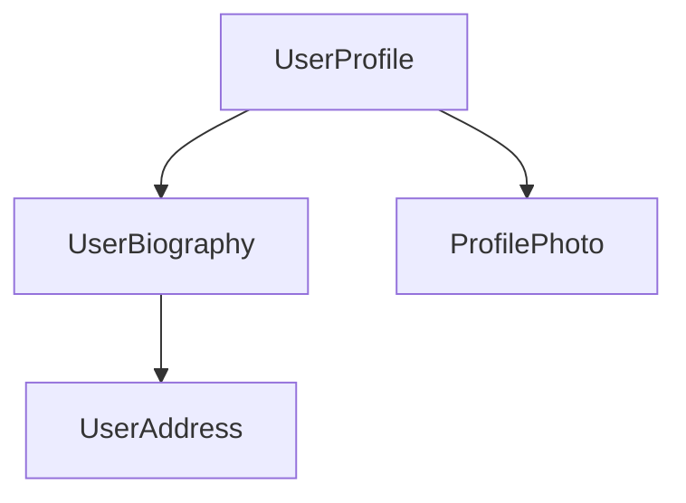

> 🌐 本文档由 [angular/angular](https://github.com/angular/angular) 翻译,英文原版见原项目。

<docs-decorative-header title="组件" imgSrc="adev/src/assets/images/components.svg"> <!-- markdownlint-disable-line -->
在 Angular 中创建应用的基础构件。
</docs-decorative-header>

组件是 Angular 应用的主要构建单元。每个组件代表较大网页中的一个部分。把应用组织成组件,有助于为项目提供结构,把代码清晰地划分为易于维护、可持续演进的具体模块。

## 定义组件

每个组件都由几个主要部分组成:

1. 一个 `@Component` [装饰器](https://www.typescriptlang.org/docs/handbook/decorators.html),包含 Angular 使用的一些配置。
2. 一个 HTML 模板,控制渲染到 DOM 中的内容。
3. 一个 [CSS 选择器](https://developer.mozilla.org/docs/Learn/CSS/Building_blocks/Selectors),定义该组件在 HTML 中的使用方式。
4. 一个承载行为的 TypeScript 类,比如处理用户输入或向服务器发起请求。

下面是一个简化的 `UserProfile` 组件示例。

```angular-ts
// user-profile.ts
@Component({
  selector: 'user-profile',
  template: `
    <h1>User profile</h1>
    <p>This is the user profile page</p>
  `,
})
export class UserProfile {
  /* Your component code goes here */
}
```

`@Component` 装饰器还可以可选地接受一个 `styles` 属性,用于为模板应用你想要的 CSS:

```angular-ts
// user-profile.ts
@Component({
  selector: 'user-profile',
  template: `
    <h1>User profile</h1>
    <p>This is the user profile page</p>
  `,
  styles: `
    h1 {
      font-size: 3em;
    }
  `,
})
export class UserProfile {
  /* Your component code goes here */
}
```

### 将 HTML 和 CSS 拆分到独立文件

你可以使用 `templateUrl` 和 `styleUrl`,把组件的 HTML 和 CSS 定义在单独的文件里:

```angular-ts
// user-profile.ts
@Component({
  selector: 'user-profile',
  templateUrl: 'user-profile.html',
  styleUrl: 'user-profile.css',
})
export class UserProfile {
  // Component behavior is defined in here
}
```

```angular-html
<!-- user-profile.html -->
<h1>User profile</h1>
<p>This is the user profile page</p>
```

```css
/* user-profile.css */
h1 {
  font-size: 3em;
}
```

## 使用组件

你通过把多个组件组合在一起来构建应用。例如,如果要构建一个用户资料页,可以这样把页面拆分为多个组件:



这里,`UserProfile` 组件使用若干其他组件,共同生成最终页面。

要导入并使用一个组件,你需要:

1. 在组件的 TypeScript 文件中,为目标组件添加一条 `import` 语句。
2. 在你的 `@Component` 装饰器中,把目标组件加入 `imports` 数组。
3. 在组件的模板中,添加一个与目标组件选择器匹配的元素。

下面是 `UserProfile` 组件导入 `ProfilePhoto` 组件的示例:

```angular-ts
// user-profile.ts
import {ProfilePhoto} from 'profile-photo.ts';

@Component({
  selector: 'user-profile',
  imports: [ProfilePhoto],
  template: `
    <h1>User profile</h1>
    <profile-photo />
    <p>This is the user profile page</p>
  `,
})
export class UserProfile {
  // Component behavior is defined in here
}
```

TIP: 想进一步了解 Angular 组件?参阅[组件深度指南](guide/components)获取完整细节。

## 下一步

你已经了解 Angular 中组件的工作方式,接下来学习如何在应用中添加和管理动态数据。

<docs-pill-row>
  <docs-pill title="使用 signals 实现响应式" href="essentials/signals" />
  <docs-pill title="组件深度指南" href="guide/components" />
</docs-pill-row>
